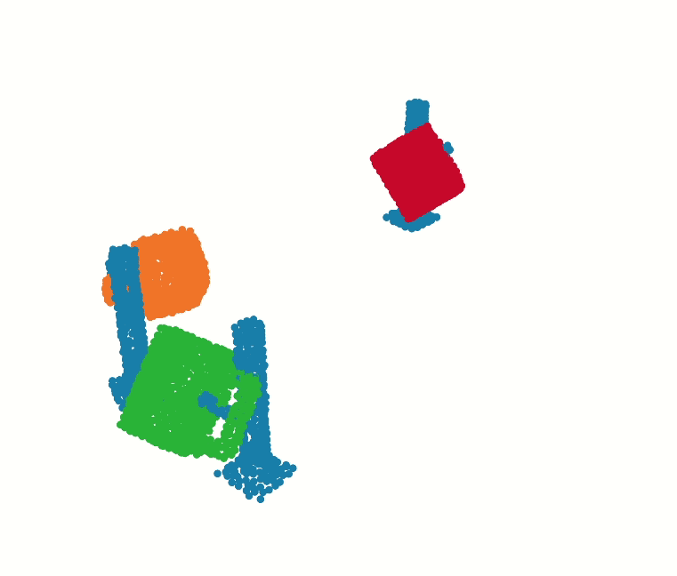
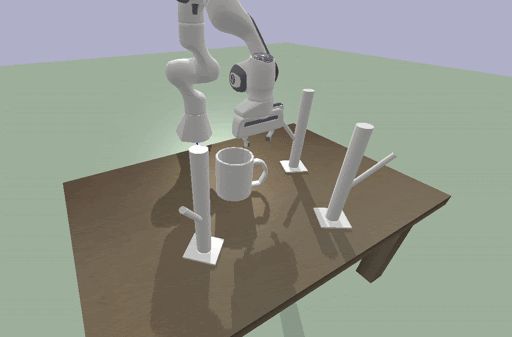

# TAXPoseD
## Learning Distributional Demonstration Spaces for Task-Specific Cross-Pose Estimation

[[Paper](https://arxiv.org/abs/2405.04609)] [[Website](https://sites.google.com/view/tax-posed/home)]

[TAX-PoseD](https://sites.google.com/view/tax-posed), a method for learning relative placement prediction tasks, learns a spatially-grounded latent distribution over demonstrations without human annotations, using an architecture with geometric inductive biases.

<p align="center">


</p>

## Repository structure

- `multimodal`- Stable latest branch
- `multimodal_dev`- Latest branch **(you are here)**
- `multimodal_icra2024`- ICRA 2024 paper's model configurations

## Installation 

To install dependencies like pytorch, ndf_robot and other libraries, please follow the instructions in the [TAX-Pose Github repo](https://github.com/r-pad/taxpose/tree/main?tab=readme-ov-file#installation). 

Then, install this repository with:

```
pip install -e .
```

## Datasets

In our paper, we use the same 1-rack NDF training dataset as TAX-Pose, as described [here](https://github.com/r-pad/taxpose/tree/main?tab=readme-ov-file#download-the-data).

We have also experimented with environments from the [RPDiff](https://github.com/anthonysimeonov/rpdiff?tab=readme-ov-file#download-assets) paper.


## Training a TAX-PoseD model

The current best model config has a long name: `joint_train_pzX-dgcnn-transformer_pzY-pn2_hybridlatentz-global_gradclip1e-4_se3-action_upright-anchor_flow-fix-post-encoder-one-flow-head_joint2global-pzY-sample_anchor2action2global-opt2-pzX-sample_mod_easy_rack`

```
python train_residual_flow_multimodal.py --config-path=../configs/rpdiff_data --config-name=joint_train_pzX-dgcnn-transformer_pzY-pn2_hybridlatentz-global_gradclip1e-4_se3-action_upright-anchor_flow-fix-post-encoder-one-flow-head_joint2global-pzY-sample_anchor2action2global-opt2-pzX-sample_mod_easy_rack dataset_root=TODO test_dataset_root=TODO log_dir=TODO rpdiff_descriptions_path=TODO
```

The ICRA submission model configurations can be run on the [multimodal_icra2024](https://github.com/himty/taxposeD/tree/multimodal_icra2024) branch.


## Cite

```
@article{wang2024taxposed,
  title={Learning Distributional Demonstration Spaces for Task-Specific Cross-Pose Estimation},
  author={Wang, Jenny and Donca, Octavian and Held, David},
  journal={IEEE International Conference on Robotics and Automation (ICRA), 2024},
  year={2024}
}
```
